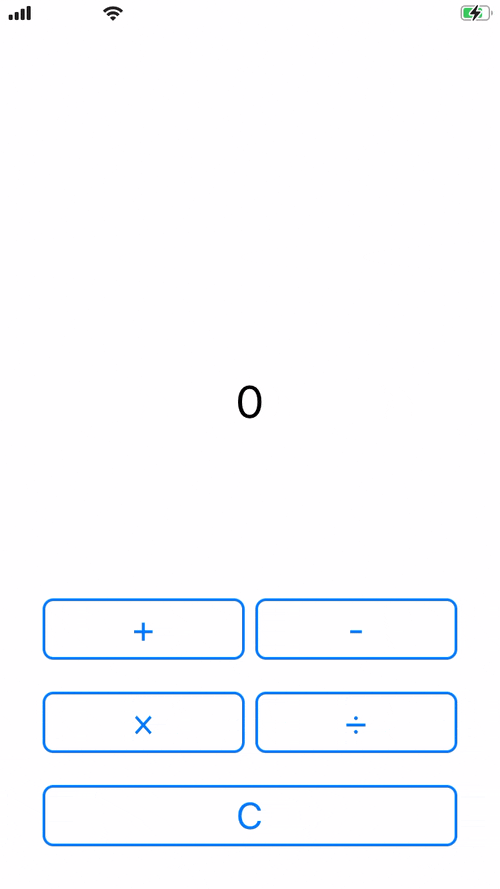
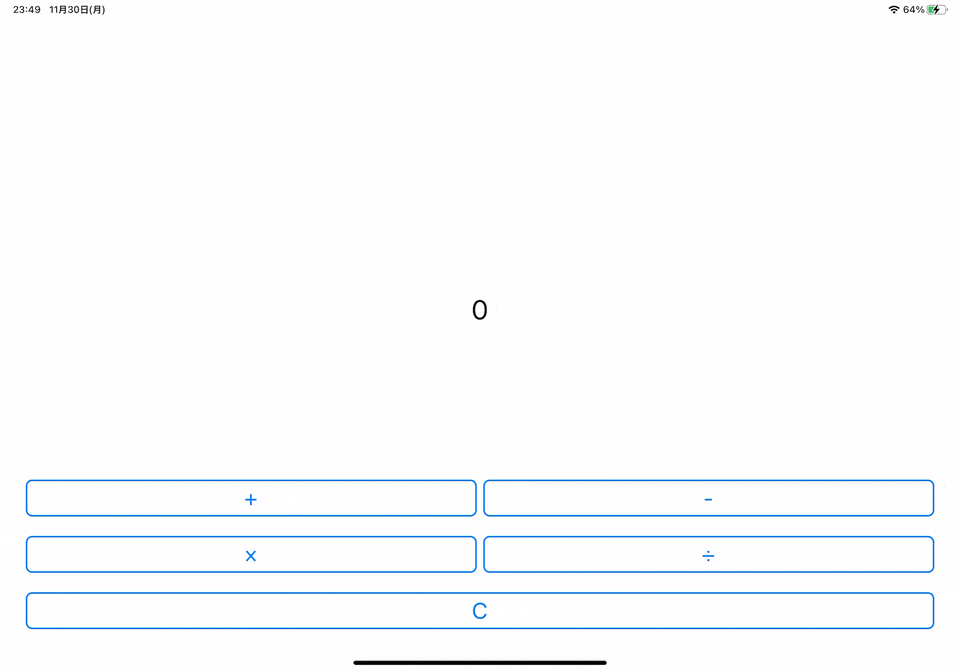

# FirebaseCountApplication

## Demo

|Device A|Device B|
|---|---|
|||

## Tasks

以下のミッションをできるだけ多くクリアすることが目標です！

- [ ] カウントアプリケーション（10分）
  - [ ] Label
  - [ ] +ボタン
  - [ ] −ボタン
  - [ ] ×ボタン
  - [ ] ÷ボタン
  - [ ] Cボタン（クリアボタン）
- [ ] Firebase/Firestore（20分）
  - [ ] Firestore上のカウントに変更があったかを監視。変更があれば、Labelに変更を反映する。
  - [ ] カウントの数字に変更があれば、Firestore上のカウントも更新する
- [ ] ボタンのデザインをアレンジする（10分）
  - [ ] ボタンを角丸にする（`cornerRadius`は8で！）
  - [ ] ボタンに枠線をつける（`borderWidth`は2で！）
  - [ ] ボタンの枠線に色をつける（`borderColor`はボタンの文字色と同じにしてみよう）

## Getting Done

以下のタスクは既に初期の段階で完了しています

- Firebase/Firestoreの初期設定

## ブランチについて

### [complete]()

全てのタスクを完了しているブランチです

### [complete_count_application]()

カウントアプリケーションの部分が完了しているブランチです